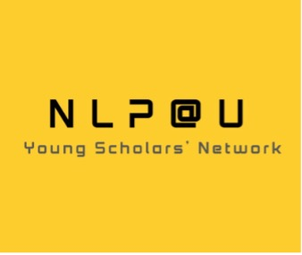

# NLP@U Young Scholar Network

The official website of the **Young Scholar Network** at the Utrecht NLP Hub — a community for PhD candidates, postdoctoral researchers, and early-career researchers in Natural Language Processing and related fields at Utrecht University and UMCU.

🌐 **Visit the site:** [nlpysn.github.io](https://nlpysn.github.io/)

## What we do

We organize talks, workshops, and networking events to connect early-career NLP researchers across Utrecht — sharing ideas, building collaborations, and supporting each other through PhD and postdoc life.

## Get involved

- 📅 Upcoming events: [nlpysn.github.io/events](https://nlpysn.github.io/events/)
- 📬 Join the network: [nlpysn.github.io/contact](https://nlpysn.github.io/contact/)
- 💼 LinkedIn: [linkedin.com/company/nlpysn](https://www.linkedin.com/company/nlpysn)

## Contact

**Hadi Mohammadi** — [h.mohammadi@uu.nl](mailto:h.mohammadi@uu.nl)

---

Utrecht NLP Hub · Utrecht University &amp; UMCU · Netherlands
